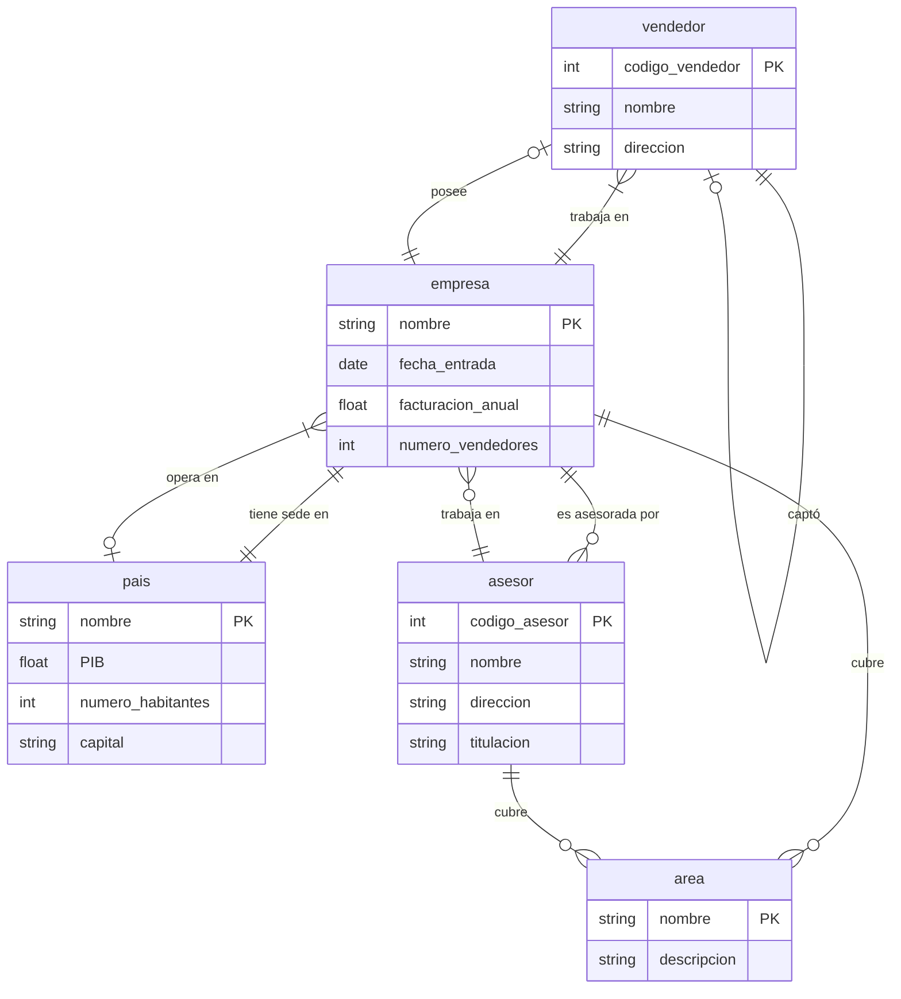

```mermaid

erDiagram
    vendedor {
        int codigo_vendedor PK
        string nombre
        string direccion
    }
    
    empresa {
        string nombre PK
        date fecha_entrada
        float facturacion_anual
        int numero_vendedores
    }
    
    area {
        string nombre PK
        string descripcion
    }
    
    pais {
        string nombre PK
        float PIB
        int numero_habitantes
        string capital
    }
    
    asesor {
        int codigo_asesor PK
        string nombre
        string direccion
        string titulacion
    }
    
    empresa ||--|| pais : "tiene sede en"
    empresa ||--o| vendedor : "posee"
    vendedor ||--o| vendedor : "captó"  
    empresa ||--o{ area : "cubre"
    empresa ||--o{ asesor : "es asesorada por"
    asesor ||--o{ area : "cubre"
    asesor ||--o{ empresa : "trabaja en"
    empresa }|--o| pais : "opera en"
    vendedor }|--|| empresa : "trabaja en"

```