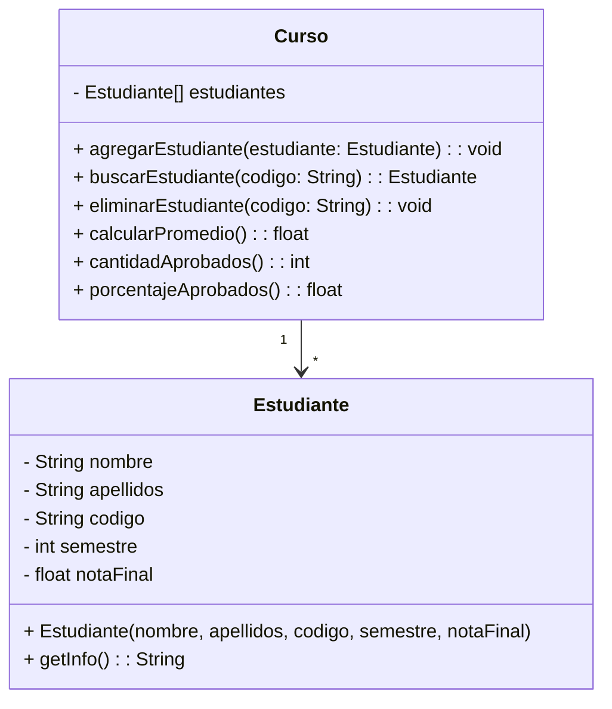

```mermaid
classDiagram
    class Estudiante {
        - String nombre
        - String apellidos
        - String codigo
        - int semestre
        - float notaFinal
        + Estudiante(nombre, apellidos, codigo, semestre, notaFinal)
        + getInfo(): String
    }
    
    class Curso {
        - Estudiante[] estudiantes
        + agregarEstudiante(estudiante: Estudiante): void
        + buscarEstudiante(codigo: String): Estudiante
        + eliminarEstudiante(codigo: String): void
        + calcularPromedio(): float
        + cantidadAprobados(): int
        + porcentajeAprobados(): float
    }
    
    Curso "1" --> "*" Estudiante
```