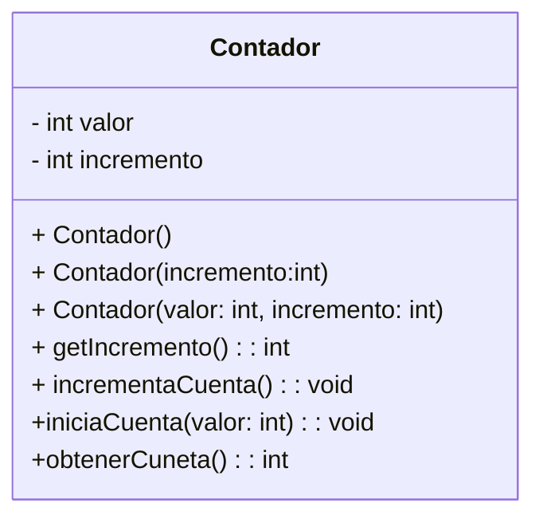

```mermaid
    classDiagram
        class Contador {
            - int valor
            - int incremento

            + Contador()
            + Contador(incremento:int)
            + Contador(valor: int, incremento: int)
            + getIncremento() : int
            + incrementaCuenta() : void
            +iniciaCuenta(valor: int) : void
            +obtenerCuneta() : int
        }
```